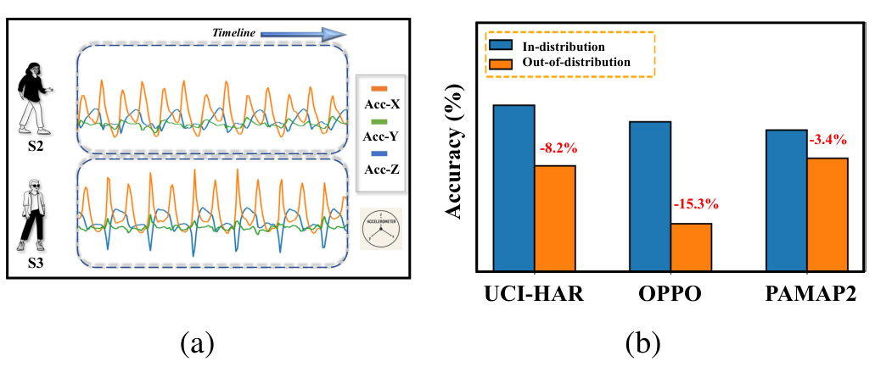
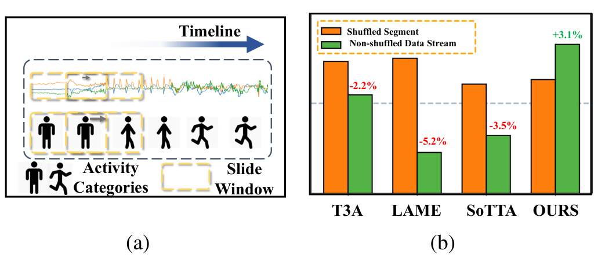

# I. Introduction

## A. Background

With the rapid advancement of wearable sensing technologies, human activity recognition (HAR) has emerged a fundamental research topic with extensive applications in health monitoring [1], smart home interactions, sports performance analysis, and medical diagnostics [2]. As sensor-based HAR systems are increasingly deployed in real-world medical scenarios, they must accommodate diverse users with varying health conditions and dynamic environments, raising growing demands for robustness, adaptability, and real-time accuracy [3]. Early HAR methods primarily relied on traditional machine learning algorithms, which achieved promising results but suffered from limited generalization capacity. Consequently, recent studies have shifted towards deep learning (DL) paradigms that move beyond handcrafted feature engineering to further enhance recognition accuracy and real-time inference capabilities [4].

## B. Key Challenges

A key limitation of current HAR methods lies in the assumption that training and testing data follow independent and identically distributed (i.i.d.) conditions. However, this assumption rarely holds for sensor-based HAR [5], as time-series signals inherently exhibit strong temporal dependencies and inter-sample correlations that violate the i.i.d. premise assumed by most adaptation algorithms. In practice, such non-i.i.d. characteristics give rise to two distinct types of out-of-distribution (OOD) challenges: **cross-person OOD**, caused by inter-individual variability (e.g., differences in body composition, gait, and habitual movement patterns) that induces domain-level distribution shifts across subjects; and **cross-category OOD**, arising from inter-class heterogeneity (e.g., differences in motion intensity or style across activities) which leads to shifts in activity-level distributions [6].

Fig. 1a illustrates the subject-wise data partitioning and inter-subject variability observed in the OPPORTUNITY dataset. Specifically, it compares ankle sensor recordings from two subjects, S2 (adult female) and S3 (adult male), both performing the "walking" activity. The acceleration magnitudes along all three axes are noticeably higher for the male subject, revealing significant cross-person differences that lead to domain-level distribution shifts [7]. Fig. 1b further illustrates the open-set cross-category setting, where two activity categories are excluded from source training and validation but retained in the final target stream as unknown classes. Under subject-wise evaluation, unseen activities remain challenging: methods that perform well under i.i.d. conditions still degrade markedly in OOD settings (cross-person/cross-category shifts), highlighting the difficulty of non-i.i.d. data in real-world HAR.

  

*Fig. 1 — Subfigure (a): Distributional heterogeneity in cross-person evaluation. Subfigure (b): Comparison of evaluation scenarios: models maintain high accuracy on in-distribution classes but experience notable degradation under cross-person and cross-category OOD testing.*

## C. Research Motivation

In response to these challenges, test-time adaptation (TTA) has been introduced [8], which seeks to adapt models using only unlabeled test data. Conventional TTA methods typically employ pseudo-label strategies to align feature distributions [9], [10], while more advanced approaches generate pseudo-labels based on output confidence and achieve feature alignment through self-training [11]–[13]. Although these methods perform effectively under moderate distribution shifts, they often degrade under severe OOD conditions due to accumulated adaptation errors [14], [15], motivating the exploration of alternative solutions.

Building upon this direction, representation learning approaches introduce prototype-based mechanisms such as T3A [16] and OFTTA [7], which derive pseudo-labels by measuring distances between test samples and class prototypes. However, when processing HAR data collected via sliding-window sampling, the non-i.i.d. property of sensor signal manifests as activity-level class imbalance [17]. As shown in Fig. 2a, we analyze the temporal sensor variations from the PAMAP2 dataset, a widely used HAR benchmark with recordings from nine subjects aged 20–30, where class imbalance becomes more apparent within small-batch segments (e.g., a subject in a short time window batch is unlikely to perform all activities such as standing, walking, and running simultaneously). Such imbalance leads to class prototypes that overlook intra-class variability, limiting their ability to capture fine-grained temporal dynamics.

Another line of research explores nearest-neighbor-based pseudo-label methods (e.g., LAME [18], TSD [12]). While these methods show promise in specific tasks with small batch samples, they ignore the global structure of the classes. As a result, samples located near the decision boundary are vulnerable to noise from neighboring classes, making them prone to misclassification and subsequently causing a notable drop in overall performance [19]. To further examine the impact of temporal continuity on TTA performance, we evaluated multiple methods based on nearest neighbors, prototypes, and memory banks under both shuffled (i.i.d.) and continuous (non-i.i.d.) temporal validation settings in Fig. 2b. The inherent correlations and temporal dependencies among samples significantly impair the performance of existing SOTA methods during inference. These findings underscore the necessity for a new framework capable of effectively addressing TTA challenges in small-batch, temporally correlated HAR data. Recent research, TEA [20] proposes an energy-based adaptation method. However, TEA incurs additional computational overhead, including generating samples through Stochastic Gradient Langevin Dynamics (SGLD), which imposes an unacceptable burden on delay-sensitive edge device deployments for HAR applications (see Fig. 10).

  

*Fig. 2 — Subfigure (a): Visualization of temporal signal variations illustrating the impact of class imbalance within small batches. Subfigure (b): Performance comparison under shuffled and continuous validation settings, showing performance degradation in SOTA methods compared to ours.*

## D. Main Contributions

Motivated by the above observations, we propose the **Dual-Space Optimization Model (DSOM)**, an effective TTA strategy that jointly exploits feature-space alignment and energy-space clustering, as illustrated in Fig. 3. Specifically:

- **Feature-Space Alignment.** To facilitate online alignment of features under real-world out-of-distribution shifts, we first update the Batch Normalization (BN) layers of the pre-trained model. Inspired by the PASLE framework [13], we replace traditional pseudo-labels with progressive selective labels. The test samples are divided into high-confidence and uncertain subsets according to the model's prediction confidence. The model parameters are then updated using two complementary loss functions, $L_{CE}$ and $L_{CC}$.
- **Energy-Space Refinement.** We incorporate prior knowledge to anchor the prototypes and employ learnable residual shifts during optimization. Class prototypes are generated via a dynamic prototype cache queue, ensuring invariance to the distribution statistics of small-batch samples and maintaining global embedding consistency. Furthermore, to achieve local optima under real-world scenarios such as class imbalance, we formulate the optimization as an energy minimization problem by minimizing the energy loss between the predicted distributions and the posterior probability distributions. Laplacian regularization $L_{lap}$ is then applied to promote local clustering via KNN-based neighborhood constraints.
- **Dual-Space Optimization Model (DSOM).** The proposed DSOM framework coordinates feature-space alignment and energy-space refinement to jointly address representation shift and decision uncertainty in non-i.i.d., small-batch sensor streams. In the first stage, the feature space is aligned by optimizing the normalization-related parameters of the backbone network while keeping the original pre-trained classifier fixed. In the second stage, after freezing the backbone network and feature extraction path, we optimize only the residual correction parameters at the output layer to adjust the energy distribution of prototype-embedding logits, while the resulting energy scores can further be used for open-set rejection. Extensive evaluations on benchmark datasets, including UCI-HAR, OPPORTUNITY, and PAMAP2, as well as edge-device deployments, demonstrate that DSOM achieves strong and robust overall performance, particularly under non-i.i.d. time-series scenarios, supporting its practical applicability to real-world HAR tasks.
